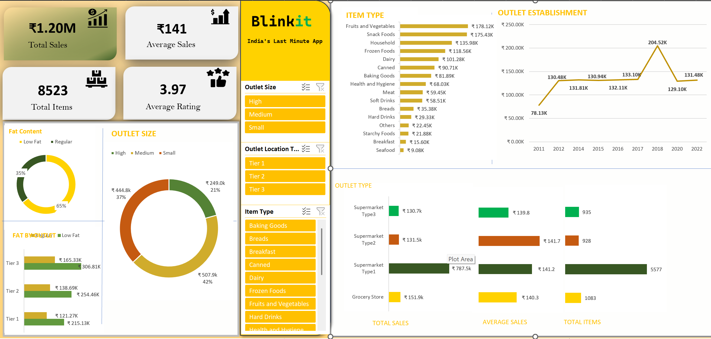

# Blinkit Data Analysis Dashboard 📊

This project provides an interactive and visually appealing dashboard for analyzing sales and performance metrics of the "Blinkit" app, a fictional platform for last-minute shopping. The dashboard highlights key sales trends, customer preferences, and outlet statistics to help make informed business decisions.

## 🔑 Features

- **Total Sales & Items**: Displays total sales revenue and the number of items sold.
- **Average Sales & Ratings**: Insights into average sales and customer ratings.
- **Fat Content Analysis**: Breakdown of sales by fat content (Low Fat vs Regular).
- **Outlet Size & Performance**: Visual representation of sales by outlet size (High, Medium, Small).
- **Outlet Type Analysis**: Detailed comparison of sales across different outlet types, including supermarkets and grocery stores.
- **Item Type Trends**: Analyzes sales for various product categories such as fruits, vegetables, snack foods, and more.
- **Outlet Establishment Timeline**: Historical trends in sales performance by outlet establishment year.

## 📊 Tools & Technologies

- **Microsoft Excel**: For creating an interactive dashboard and data visualization.
- **Data Analysis**: Leveraging insightful visuals and filters to explore sales data and trends.

## 📸 Screenshots

## 📝 Insights Derived

- **Sales Performance**: ₹1.20M in total sales with ₹141 average sales per item.
- **Customer Preference**: Majority prefer low-fat products (65%).
- **Outlet Trends**: High-sized outlets contribute the highest sales (37%).
- **Popular Categories**: Fruits, Vegetables, and Snack Foods are the top-performing item types.

## 💡 Future Enhancements

- Integrate real-time data for dynamic updates.
- Add forecasting capabilities to predict future sales trends.
- Enhance interactivity with more drill-down options.

## 🤝 Contributing

Contributions are welcome! Feel free to submit a pull request or open an issue to suggest improvements.

## 🛡️ License

This project is licensed under the MIT License.

---

### 📬 Contact

For queries or feedback, feel free to contact me at [your email].
